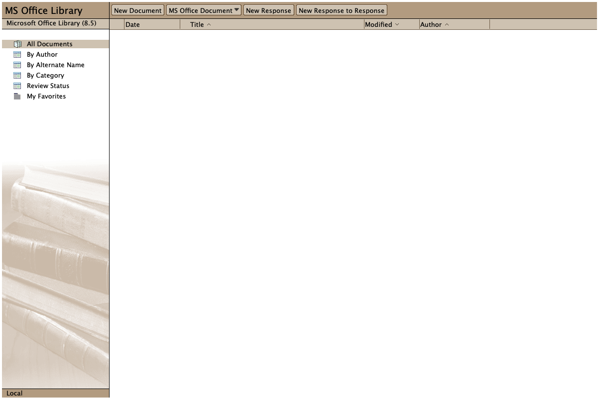

<h1>HCL Domino Microsoft Office Library Template</h1>
This is the HCL Domino Template "Microsoft Office Library" which can be used with the HCL Notes and/or Nomad Clients.
Note: This template is not intended for Web (browser) use and is not supported on the Macintosh.

  

    Table of contents
  

  {: .text-delta }
1. TOC
{:toc}

## What does this database do?
This database gives Notes users the ability to seamlessly create and save documents using Microsoft Word, Excel, PowerPoint, or Paintbrush, without leaving Notes.  In addition, the library serves as an electronic filing cabinet for these documents, making it easy for all members of a workgroup to locate, update, and print desired documents.  The database might contain anything from environmental impact statements for a group of engineers using Word to financial statements for a group of loan officers using Excel.
Besides being a repository and point of interaction for documents created with Microsoft application software, the document library includes other important document management features.  These features include archiving and review cycle capabilities.

## Who will use this database?
Anyone who wishes to create a record of a document or review available documents may use this database.

## Important Features
- Review Cycle: Used to route a document to a series of recipients.
- Document Archiving: Used to move expired documents to an archive database.
- OLE/ActiveX: Notes launches Microsoft Office applications in-place active instead of in a separate window.  This gives the user the feeling of being in the OLE application while still being in Notes.
- Word templates:  Used to create new Word documents based on existing Word templates that come with MS Word or users can select Word templates that they have created.
- Migration Tool: Used to quickly migrate existing Microsoft files (Excel, PowerPoint, Word, and Paintbrush) from a central location on a local or network drive and embed them as OLE (object linking and embedding) objects into separate Notes documents.

## Suggestions for Modifications
- Full text search: If you wish to use Notes' full text search capabilities for a database created with this template, select menu File, Database, Properties, go to the Full Text panel and then select Create Index... to create the full text index.

## Where to find more information?
-  More information can be found in the Using This Database document.

## Access Control
-  Very Important:  Access level should be Author for all users of this database.  This will prevent unauthorized editing of documents within the database.  The Author fields within the forms govern who will be able to edit/review particular documents.   Errors will occur if someone with Editor access attempts to review a document when they are not an authorized reviewer of that document.

## Important Note
- The Microsoft Office Library template should only be used to create new applications. Upgrading existing Document Library applications with this template is not supported.
